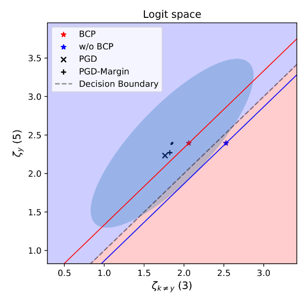
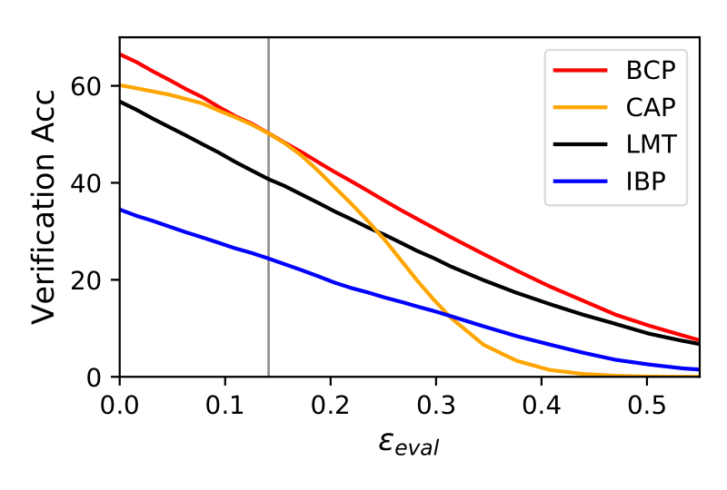

# Lipschitz-Certifiable Training with a Tight Outer Bound

This repository is the official implementation of BCP (Box Constraint Propagation) by Sungyoon Lee, Jaewook Lee, and Saerom Park.

BCP is a certified adversarial defense method against _l_<sub>2</sub>-norm (or _l_<sub>p</sub>-norm, p>0) bounded perturbations.
It propagates a box constraint in addition to the Lipschitz outer bound to obtain a tighter outer bound.
The propagation scheme is briefly illustrated as follows:


By introducing additional box constraint, we can cut off the area below the red line from the Lipschitz outer bound (the elliptic area) in the following visualization.

<!----
<a href="https://www.codecogs.com/eqnedit.php?latex=l_2" target="_blank"></a>-norm (or <a href="https://www.codecogs.com/eqnedit.php?latex=l_p" target="_blank"></a>-norm)
__l__<sub>2</sub>-norm
__l__<sub>p</sub>-norm, p>0

---->


<!----
> 📋Optional: include a graphic explaining your approach/main result, bibtex entry, link to demos, blog posts and tutorials
---->

## Requirements

To install requirements, modify environment.yml and run this command:

```setup
conda env create -f environment.yml
```

<!----
> 📋Describe how to set up the environment, e.g. pip/conda/docker commands, download datasets, etc...
---->

## Training (and Evaluation)

To train a certifiably robust model with the proposed method, run this command:

```train
python main_mnist.py
python main_cifar10.py
```
See BCP-train-demo-cifar10.ipynb for more details

<!----
> 📋Describe how to train the models, with example commands on how to train the models in your paper, including the full training procedure and appropriate hyperparameters.
---->


## Pre-trained Models

You can download pretrained models here:

- [BCP model](https://drive.google.com/file/d/17MsumEnGQvpMQaXMXRZK4xK8mpnO0oRz/view?usp=sharing) trained on MNIST.
- [BCP model](https://drive.google.com/file/d/1MuXNJ63_HwzKtBMrRlvrLGIzD3FhH-Ov/view?usp=sharing) trained on CIFAR-10.


<!----
> 📋Give a link to where/how the pretrained models can be downloaded and how they were trained (if applicable).  Alternatively you can have an additional column in your results table with a link to the models.
---->

## Evaluation of pretrained models

After downloading the pretrained models to the directory ./pretrained, you are ready to evaluate them.
To evaluate the pretrained model, run:

```eval
python evaluation_mnist.py --test_pth pretrained/mnist_save.pth
python evaluation_cifar10.py --test_pth pretrained/cifar10_save.pth
```

<!----
> 📋Describe how to evaluate the trained models on benchmarks reported in the paper, give commands that produce the results (section below).
---->

## Results

Our model achieves the following performance against _l_<sub>2</sub>-perturbation compared to state-of-the-art methods ([CAP](https://arxiv.org/abs/1805.12514), [LMT](https://arxiv.org/abs/1802.04034), [IBP](https://arxiv.org/abs/1810.12715)) :

### CIFAR-10 (&epsilon;<sub>2</sub>=36/255)

<!----

---->


### MNIST (&epsilon;<sub>2</sub>=1.58)

| Model name         | Standard  | PGD^100 | Verification  |
| ------------------ |---------------- | -------------- | --------------  |
| BCP                |     **92.54%**         |      **66.23%**       | **48.20%**  |
| CAP                |     88.39%         |      62.25%       | 43.95%  |
| LMT                |     86.48%         |      53.56%       | 40.55%  |

<!---
Model1

| Model name         | Standard  | PGD^100 | Verification  |
| ------------------ |---------------- | -------------- | --------------  |
| BCP                |     65.64         |      59.59%       | 50.27%  |
| [CAP](https://arxiv.org/abs/1805.12514)                |     60.14%         |      55.67%       | 50.29%  |
| [LMT](https://arxiv.org/abs/1802.04034)               |     56.49%         |      49.83%       | 37.20%  |

Model2

| Model name         | Standard  | PGD^100 | Verification  |
| ------------------ |---------------- | -------------- | --------------  |
| BCP                |     65.72%         |      60.78%       | 51.30%  |
| [CAP](https://arxiv.org/abs/1805.12514)                |     60.10%         |      56.20%       | 50.87%  |
| [LMT](https://arxiv.org/abs/1802.04034)               |     63.05%         |      58.32%       | 38.11%  |
-->

### Tiny ImageNet (&epsilon;<sub>2</sub>=36/255)

| Model name         | Standard  | PGD^100 | Verification  |
| ------------------ |---------------- | -------------- | --------------  |
| BCP                |     28.76%         |      26.64%       | 20.08%  |

<!----
> 📋Include a table of results from your paper, and link back to the leaderboard for clarity and context. If your main result is a figure, include that figure and link to the command or notebook to reproduce it. 
---->

<!----
## Contributing
> 📋Pick a licence and describe how to contribute to your code repository. 
---->

keywords: deep learning, robustness, adversarial examples, adversarial attack, adversarial training, certified defense, provable defense, Lipschitz analysis
